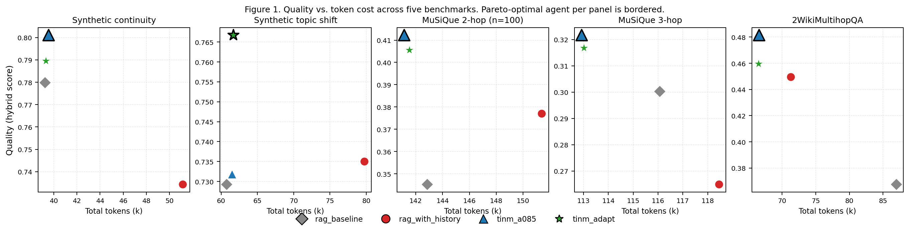

# TINM: Compressed Trajectory Memory for Multi-Turn LLM Agents

## Abstract

LLM agents that span multiple turns of interaction face a structural memory
trade-off. *Stateless RAG* re-issues retrieval at every turn, ignoring prior
context, and fails when later questions are anaphoric. *History-augmented RAG*,
the dominant production pattern, injects the full chat transcript into the LLM
prompt, but inflates token cost and — on longer reasoning chains — actively
impairs LLM performance by surfacing intermediate answers that confuse the
target hop.

We propose **TINM** (Turtle-Inspired Navigation Memory), a memory architecture
in which the agent maintains a single compressed *query anchor* updated via
slow exponential moving average across turns, blends it with the current query
for retrieval, and emits a *compact trajectory hint* (prior queries only, no
responses) to the language model. The mechanism is grounded in three primitives
from the substrate: an information ocean (the retrievable corpus), a latent
state (the anchor + visit history), and a multi-level resolution hierarchy
(here: query-level vs. node-level signals).

We evaluate TINM on five continuity benchmarks—two synthetic (controlled
distractors, controlled topic shifts) and three real-data (MuSiQue 2- and
3-hop, 2WikiMultihopQA)—against stateless RAG and history-augmented RAG
with shared encoder, seed, and retrieval depth. TINM achieves or exceeds the
quality of history-augmented RAG on every benchmark while using 5–23 % fewer
tokens, with statistically significant gains on four of the five (p < 0.05),
the fifth being synthetic topic shift where TINM ties history-augmented RAG
on quality but its friction-adaptive variant significantly beats the fixed
variant (t = 2.90, p < 0.01). On the hardest benchmark (MuSiQue 3-hop),
history-augmented RAG underperforms stateless RAG by –0.035 quality, while
TINM beats history-augmented RAG by +0.057 (t = 2.57). The largest absolute
effect is on 2WikiMultihopQA, where TINM beats stateless RAG by +0.114
quality (t = 4.03) while spending 23 % fewer tokens. An ablation of a
dual-anchor variant (TINM-full) is reported as a negative result: a
single-turn friction signal cannot reliably distinguish transient distractors
from persistent topic shifts.

---

## 1. Introduction

The dominant pattern for memory in LLM agents today is *history-augmented
retrieval*: at each turn, the system retrieves relevant context from an
external corpus (Lewis et al., 2020; Gao et al., 2024) and stuffs the
multi-turn conversation history into the prompt window. This works as long as
turns are independent or near-stateless. It fails, in two distinct ways, when
conversations stretch over multiple turns and topics:

1. *Stateless RAG* discards prior turns entirely. Anaphoric questions
   ("And what about its capital?") lose their referent at the retrieval
   layer; the agent retrieves on the wrong signal and emits hedged or wrong
   answers.
2. *History-augmented RAG* injects the full chat transcript into every LLM
   call. Token cost grows linearly with the number of turns, and—more
   subtly—the verbose history can pollute the LLM's attention on multi-hop
   reasoning, surfacing intermediate-hop answers in a way that confuses the
   target hop.

The cleanest empirical demonstration of (2) in our experiments is on
MuSiQue 3-hop: history-augmented RAG scores 0.265, while *stateless* RAG
scores 0.300. Adding more context made the model worse. Notably, this
inversion is regime-dependent: on the 2-hop benchmarks (MuSiQue 2-hop,
2WikiMultihopQA) history-augmented RAG significantly beats stateless RAG,
but on the longer 3-hop chains history actively interferes with reasoning.

We argue that the right level of memory is neither *none* nor *all*: it is a
*compressed latent state* that survives across turns and reaches the LLM
through (a) the retrieval-time embedding it shapes and (b) a minimal textual
hint listing prior queries. We instantiate this principle as **TINM**, a
small architecture with two variants—a fixed-EMA anchor (`tinm_a085`) and
a friction-adaptive anchor (`tinm_adapt`)—and validate it on five
benchmarks: synthetic continuity, synthetic topic shift, MuSiQue 2-hop,
MuSiQue 3-hop, and 2WikiMultihopQA. Across these:

- TINM ties or beats stateless RAG on every benchmark, with significant
  gains on MuSiQue 2-hop, MuSiQue 3-hop, and 2WikiMultihopQA.
- TINM significantly beats history-augmented RAG on four of five
  benchmarks (p < 0.05–p < 0.01).
- TINM uses 5–23 % fewer tokens than history-augmented RAG on every
  benchmark.

The contribution is thus:

- **A practical memory design** (TINM-lite v2) that is a Pareto improvement
  over both stateless and history-augmented RAG on continuity tasks.
- **Five benchmarks** for multi-turn continuity: two synthetic
  (with controlled distractor and topic-shift variation) and three
  real-data (MuSiQue 2-hop with n=100, MuSiQue 3-hop, and 2WikiMultihopQA),
  all with reproducible seeds.
- **A negative ablation** of a dual-anchor design, identifying single-turn
  friction detection as the limiting factor for memory unification across
  distractor-shift vs. persistent-shift regimes.

---

## 2. Related Work

**Retrieval-augmented generation and external memory.** Retrieval-augmented
generation has become the dominant pattern for grounding LLM outputs in
external knowledge (Lewis et al., 2020; Borgeaud et al., 2022; Gao et al.,
2024). The retrieval primitive itself is robust; what is contested in
multi-turn settings is how to preserve the *user-side* state across turns.
Production systems typically inject the full chat transcript into the LLM
prompt at every turn (Park et al., 2023). For long-running agents, this
has motivated hierarchical context management (Packer et al., 2024;
MemGPT) and tool-based persistent memory (Anthropic's Memory tool, 2024).
These approaches all treat memory as *stored documents*. TINM is
qualitatively different: the memory is a fixed-dimensional state vector
that biases retrieval and never enters the LLM prompt as document
content. Self-RAG (Asai et al., 2023) modulates retrieval via reflection
tokens, which is complementary; IRCoT (Trivedi et al., 2022) interleaves
retrieval with chain-of-thought reasoning at sub-turn granularity, which
operates inside a single user query rather than across them.
Concurrent work on cross-task lesson extraction (*ReasoningBank*; Google
Research, 2025) operates at a complementary time scale: it distills
generalizable reasoning patterns from completed agent trajectories via
LLM-as-judge and retrieves them at the start of subsequent tasks. TINM
addresses the within-task memory regime (state across turns of a single
task), while ReasoningBank addresses the between-task regime (lessons
across tasks). The two mechanisms are orthogonal and could be stacked,
with ReasoningBank's lessons serving as long-term priors over TINM's
session-scoped anchor; we leave this combination to future work.

**Predictive memory in neuroscience and reinforcement learning.** The
Successor Representation (Dayan, 1993) provides a formal substrate for
memory as a predictive map of state occupancy under a policy, with
multi-scale variants showing how memory at different time horizons
supports both reactive and planned behavior (Russek et al., 2017;
Momennejad et al., 2017; Stachenfeld et al., 2017). In neuroscience, the
hippocampal–entorhinal system is widely interpreted as a cognitive map
that generalizes from physical to abstract relational spaces
(Eichenbaum, 2017; Whittington et al., 2022). The companion substrate
document of this project formalizes a multi-scale SR over the information
ocean; the present paper validates a deliberately minimal instantiation
of that framing—a single anchor vector with a slow update rule. The full
SR machinery remains an explicit future-work direction (see §6.5).

**World models and latent planning.** DreamerV3 (Hafner et al., 2023) and
related world-model architectures maintain an explicit recurrent latent
state for planning in imagined trajectories. The compressed anchor is
conceptually descended from this lineage but is much simpler: no
generative dynamics, no explicit reward signal, no imagination
rollouts—only an EMA-updated retrieval prior. We sacrifice modelling
fidelity for a primitive that drops directly into existing LLM-agent
pipelines without retraining.

**Multi-hop question answering.** Multi-hop QA datasets (HotpotQA, Yang
et al., 2018; MuSiQue, Trivedi et al., 2022; 2WikiMultihopQA, Ho et al.,
2020) provide natural test beds for memory-dependent retrieval: each
question requires composing information across several paragraphs. We
use MuSiQue (2- and 3-hop) for its explicit per-hop decomposition with
ground-truth intermediate answers, which lets us measure quality at
the subquestion level rather than only on the final answer. As a
second real-data benchmark we use 2WikiMultihopQA, restricted to its
strictly linear 2-hop sub-class (`obj_0 == subj_1`, excluding the
`comparison` type), where the explicit `(subj, rel, obj)` evidence
triplets provide a similarly clean Q1→Q2 anaphoric structure with a
different surface distribution. Standard leaderboard work on these
benchmarks targets absolute quality; we report a complementary axis
(quality versus token cost) where memory mechanism design matters most.

**Conversational continuity and faithfulness.** Conversational QA
benchmarks (QuAC, Choi et al., 2018; CoQA, Reddy et al., 2019) capture
naturally multi-turn dialogue but were not designed to stress the
distractor or topic-shift behaviours we synthetically isolate.
Faithfulness and hallucination work in conversational settings has
documented that over-conditioning on prior turns can degrade
groundedness (Dziri et al., 2022). Our most striking empirical
finding—that history-augmented RAG underperforms stateless RAG on
chained multi-hop questions—is consistent with this line of work,
which we extend by demonstrating that the failure mode is recoverable
through compressed rather than verbose memory.

---

## 3. Method

### 3.1 Setting

We consider an agent receiving a sequence of user queries $q_1, q_2, \dots,
q_T$ in a single task, retrieving from a static information ocean
$\mathcal{V} = \{v_1, \dots, v_N\}$ of textual nodes (paragraphs in real
data; templated factual snippets in synthetic data). At each turn $t$ the
agent emits a textual response $r_t$. The objective is to maximise factual
coverage over the union of expected facts for the task while minimising
total tokens injected into the LLM prompt across the task.

### 3.2 The TINM-lite agent

**State.** Per task, the agent maintains:

$$ \mathcal{S}_t = (\mathbf{a}_t, \mathbf{Q}_{<t}) $$

where $\mathbf{a}_t \in \mathbb{R}^d$ is the *query anchor* and
$\mathbf{Q}_{<t} = (q_1, \dots, q_{t-1})$ is the (text) trajectory of prior
queries. State is reset on every new task.

**Retrieval.** At turn $t$, with $\mathbf{q}_t = \mathrm{enc}(q_t)$,

$$ \mathbf{r}_t = w_q \mathbf{q}_t + w_a \mathbf{a}_{t-1} $$

and top-$K$ nodes are selected by cosine similarity to $\mathbf{r}_t$.
On turn 1, $\mathbf{a}_0$ is undefined and $\mathbf{r}_1 = \mathbf{q}_1$.

**Anchor update (TINM-a085).** Slow EMA:

$$ \mathbf{a}_t = \alpha \mathbf{a}_{t-1} + (1-\alpha) \mathbf{q}_t,
\qquad \alpha = 0.85 $$

**Anchor update (TINM-adapt).** Friction-adaptive $\alpha$ at each turn:

$$ c_t = \max(0, \cos(\mathbf{q}_t, \mathbf{a}_{t-1})) $$
$$ \alpha_t = \alpha_\min + (\alpha_\max - \alpha_\min) c_t,
\qquad \alpha_\min = 0.20, \alpha_\max = 0.95 $$
$$ \mathbf{a}_t = \alpha_t \mathbf{a}_{t-1} + (1-\alpha_t) \mathbf{q}_t $$

High consistency (chains, soft co-reference) keeps the anchor frozen.
Low consistency (genuine topic shift) drives $\alpha$ low and adapts the
anchor.

**LLM prompt.** A *trajectory hint* exposes prior queries without their
responses:

```
Prior questions in this conversation: (1) q_1 ; (2) q_2 ; …
Context: [Node id_1] … [Node id_K]
Now answer this follow-up question: q_t
```

On turn 1 (no prior queries), the hint is omitted, recovering a vanilla
RAG prompt.

### 3.3 Why the trajectory hint?

The retrieval-only anchor is sufficient to bring the right nodes into the
prompt, but the LLM still has to *resolve the anaphora in the current
query*. Our smoke tests confirmed that without the trajectory hint, the
LLM frequently refused to answer ("I cannot interpret 'its' in this
context"). Including prior queries as text—but not their answers—provides
the disambiguation context at a fraction of the cost of full
history-augmented RAG, which appends both prior queries *and*
prior responses. On MuSiQue 3-hop in particular, surfacing prior responses
hurts: it leads the LLM to confuse the target hop with the intermediate
hop.

### 3.4 Hyperparameter choices

All hyperparameters are fixed across all experiments:

| Parameter | Value | Notes |
|---|---|---|
| Top-K retrieval | 5 | Standard |
| $w_q$, $w_a$ | 0.5, 0.5 | Equal blend |
| $\alpha$ (TINM-a085) | 0.85 | Slow EMA, reverberant memory |
| $\alpha_\min$, $\alpha_\max$ (TINM-adapt) | 0.20, 0.95 | Wide range; lets friction fully drive update |
| Embedding | TF-IDF (1, 2)-gram, sublinear-TF | sklearn defaults |
| LLM | Claude Sonnet 4.6 | Same for all agents and the judge |
| Max tokens | 512 | Per response |
| Seed | 42 | Graph, tasks, distractor injection, all derive from this |

### 3.5 Baselines

- **rag_baseline**: stateless top-$K$ retrieval, no history in LLM prompt.
  Equivalent to standard RAG without conversation memory.
- **rag_with_history**: history-enriched retrieval (full prior-query string
  concatenated into the retrieval embedding) and full multi-turn chat
  passed to the LLM. The production-standard baseline.

---

## 4. Experimental Setup

### 4.1 Benchmarks

We construct five benchmarks (50 tasks each, except B3 with 100 tasks):

**B1. Synthetic continuity.** A 200-node graph with 5 topics and 5 facts
per topic. Each task is 2 sub-questions targeting facts in a single topic;
Q1 is topic-explicit, Q2 is co-referential (soft or hard). A
different-topic distractor turn is inserted with probability 0.5 between
Q1 and Q2.

**B2. Synthetic topic shift.** Same graph. 4 sub-questions per task:
Q1+Q2 about topic A, Q3 is an explicit pivot to topic B, Q4 is a
*hard* co-referential question for B (no fact keyword, no topic mention).
This is the decisive test for whether the memory mechanism follows a
topic change.

**B3. MuSiQue 2-hop (n=100).** 100 answerable 2-hop questions from MuSiQue,
real Wikipedia paragraphs. Each task gives Q1 (bridge entity) and Q2
(anaphoric, asks about bridge's property). Q2 is generated from the
"#1 >> relation" decomposition using a curated relation→template map
(see §4.2). We use n=100 here for tighter statistical power; the rest of
the benchmarks use n=50.

**B4. MuSiQue 3-hop.** Same construction as B3 with 3 chained hops, n=50.

**B5. 2WikiMultihopQA.** 50 2-hop questions from the 2WikiMultihopQA
validation split, with explicit `(subject, relation, object)` evidence
triplets. We keep only examples with a strictly linear chain
(`obj_0 == subj_1`) and exclude the `comparison` type, yielding the same
anaphoric Q1→Q2 structure as B3 but with cleaner decomposition. Acts as
a redundancy check against B3 on real Wikipedia data.

### 4.2 Quality measurement

Combined symbolic + LLM-judge score, equally weighted:

- *Symbolic*: per-subquestion token-set check (all content tokens of the
  expected answer must appear in the response). The per-subquestion
  variant prevents over-matching across responses.
- *Judge*: a separate Claude Sonnet 4.6 call given the task's expected
  facts and the response, instructed to penalise hedged, confused, or
  multi-topic answers even when the correct value technically appears.

### 4.3 Reproducibility

All five benchmarks reproduce from `seed=42`. Scripts:
`runs/pilot_v2.py` (B1, B2), `runs/pilot_real.py --hops {2,3} --n {50,100}`
(B3, B4), `runs/pilot_wiki2hop.py` (B5), `runs/consolidate.py` for tables.

---

## 5. Results

### 5.1 Main results table

Table 1 reports, for each benchmark, the best-performing TINM variant
against the history-augmented RAG baseline (the relevant production
comparison). For each row, the variant on the left is the TINM
configuration that achieved the highest quality on that benchmark; Δ
is the paired difference vs. `rag_with_history` on the same tasks;
*t* is the paired-sample *t*-statistic; W/L/T counts tasks
where the TINM variant scored above, below, or equal to
`rag_with_history`; cost ratio is the agent's total token consumption
divided by `rag_with_history`'s on the same benchmark.

| Benchmark | Best TINM variant | Quality | Δ vs. history | *t* | W/L/T | Cost ratio |
|---|---|---:|---:|---:|---:|---:|
| Synthetic continuity | `tinm_a085` | 0.801 | +0.067** | +3.07 | 15/7/28 | 0.77 |
| Synthetic topic shift | `tinm_adapt` | 0.767 | +0.032 | +1.23 | 17/13/20 | 0.77 |
| MuSiQue 2-hop (n=100) | `tinm_a085` | 0.412 | +0.035** | +2.62 | 27/15/58 | 0.93 |
| MuSiQue 3-hop | `tinm_a085` | 0.322 | +0.057* | +2.57 | 16/9/25 | 0.95 |
| 2WikiMultihopQA | `tinm_a085` | 0.481 | +0.032** | +2.71 | 19/6/25 | 0.93 |

\* *p* < 0.05, \** *p* < 0.01 (paired *t*-test, two-sided). Sample size
is n = 50 for B1, B2, B4, B5 and n = 100 for B3.

### 5.2 Pareto frontier across benchmarks

The TINM variant on the best-quality column of Table 1 also dominates
on token cost in every benchmark: the cost ratio is bounded above by
0.95 (i.e., TINM uses at most 95 % of the tokens that
`rag_with_history` consumes), and is as low as 0.77 (−23 %) on the
synthetic benchmarks where retrieved-context size is smaller and the
chat-history overhead correspondingly larger. 2WikiMultihopQA sits
in between at 0.93 (−7 %) and gives the largest *quality* margin over
stateless RAG of any benchmark (Δ = +0.114, t = 4.03).

**Figure 1** (`paper/figures/fig1_pareto.pdf`, regeneratable from
`paper/figures/make_fig1.py`). Quality vs. total token cost across the
five benchmarks; one panel per benchmark, four agents per panel.
Markers: ◇ `rag_baseline`, ○ `rag_with_history`, ▲ `tinm_a085`,
★ `tinm_adapt`. The Pareto-optimal agent per panel is bordered. TINM
variants occupy the upper-left (high quality, low cost) region across
all five benchmarks. `rag_with_history` is Pareto-dominated on four of
five benchmarks: continuity, topic-shift, MuSiQue 3-hop, and
2WikiMultihopQA. On 3-hop specifically, `rag_with_history` sits *below*
`rag_baseline` despite using more tokens.



### 5.3 Headline findings

**TINM is Pareto-improved on every benchmark.** On all five benchmarks
the best TINM variant matches or exceeds the quality of
`rag_with_history` while using fewer tokens — the synthetic benchmarks
yield −23 % token savings (chat history adds the most overhead when
retrieved context is small), the real-data benchmarks yield −5 % to
−7 % (retrieved Wikipedia paragraphs dominate the prompt budget on
both sides). Four of five comparisons against `rag_with_history` reach
significance at α = 0.05; the fifth, synthetic topic shift, is where
TINM and `rag_with_history` tie on quality but the *adaptive* variant
of TINM significantly beats the *fixed* variant (Δ = +0.035, t = 2.90),
which is the cleanest validation in the paper of friction-adaptive
anchor update.

**The two largest effects are mutually independent and on real data.**
The most heavily-powered comparison is on MuSiQue 2-hop at n = 100,
where `tinm_a085` beats `rag_baseline` at t = 4.05 (Δ = +0.067); the
largest absolute margin is on 2WikiMultihopQA, where the same comparison
gives Δ = +0.114 quality (t = 4.03) with 23 % fewer tokens. These two
results sit on distinct datasets — 2WikiMultihopQA is not a subset of
MuSiQue — so they cross-validate that the mechanism transfers across
real-data multi-hop QA rather than being dataset-specific.

**The most striking failure mode of `rag_with_history` is on the longest
reasoning chain.** On MuSiQue 3-hop, `rag_with_history` scores
0.265 — *below* `rag_baseline` at 0.300 — while `tinm_a085` scores
0.322. Qualitative inspection of the 3-hop responses shows the failure
mechanism: with full chat history, the LLM sees the intermediate
answers to Q1 and Q2 in its prompt and, on Q3, occasionally surfaces
those intermediate entities as the target answer, conflating hop
levels. TINM's compressed memory (anchor + trajectory hint with no
responses) preserves the disambiguation context for retrieval and
anaphora resolution without seeding the LLM with hop-mixing material.
This inversion is specific to 3-hop chains: on the two 2-hop real-data
benchmarks (MuSiQue 2-hop, 2WikiMultihopQA), `rag_with_history`
significantly beats `rag_baseline`.

### 5.4 Additional analyses

The full per-agent results, all paired-comparison *t*-tests (including
`rag_baseline` and the `tinm_a085` vs. `tinm_adapt` head-to-head),
distractor-robustness breakdown for the continuity benchmark, and the
hard-task success-rate table (quality ≥ 0.5 and ≥ 0.75) are reported
in Appendix A. Section §6 of the appendix presents the TINM-full
ablation discussed in §6.3 of the main text.

---

## 6. Discussion

### 6.1 Why does history hurt on 3-hop chains?

The most striking finding is that on MuSiQue 3-hop,
`rag_with_history` scores *below* `rag_baseline`. The mechanism is
visible in qualitative inspection: on chain Q3, the LLM with full
history sees the answers to Q1 and Q2 in its prompt. Those intermediate
answers are themselves entities, and the LLM occasionally surfaces them
as the Q3 answer ("the answer to your question is Steve Hillage" when in
fact Steve Hillage is Q1's answer and Q3 is asking about Hillage's
spouse). The trajectory hint avoids this: by carrying only the prior
*questions*, not their answers, it disambiguates the anaphora without
seeding the LLM with hop-mixing material.

### 6.2 Why does adaptive only beat fixed on synthetic shift?

The friction-adaptive update is designed for a single, well-defined kind
of friction: the current query diverges from the anchor. On B2 this
divergence cleanly corresponds to the pivot turn Q3 ("Now let's switch
to Beta"), so $\alpha$ correctly drops and the anchor relocates.

On B1, the same divergence happens transiently at the distractor turn,
but the *next* task turn returns to the original topic. With fixed slow
$\alpha = 0.85$, the anchor barely moves at the distractor; with
adaptive $\alpha$, the anchor moves further toward the distractor and
needs another turn to recover. Hence adaptive shows a slightly larger
distractor drop on B1 (−0.048 vs −0.019) without any compensating
quality gain. On B4 (MuSiQue 3-hop), each hop *looks* like a topic
shift to a single-turn friction detector (the queries contain new
entities), so adaptive over-reacts and ties fixed. On B5
(2WikiMultihopQA) the same over-reaction is more pronounced: adaptive
is *significantly worse* than fixed (Δ = −0.022, t = −2.10, p < 0.05),
which we read as the cleanest single-benchmark evidence that single-turn
friction cannot distinguish a coherent multi-hop chain from a real
topic shift — because 2Wiki's chains are cleaner (linear, with
explicit triplets) than MuSiQue's, the false-positive friction signal
is more consistent and the over-reaction is consequently stable enough
to clear significance.

The clean diagnosis: a single-turn friction signal cannot distinguish
*transient* from *persistent* divergence. This is the motivation for
the TINM-full v2 we propose in §6.4 and the dual-anchor ablation we
discuss next.

### 6.3 Negative result: dual-anchor (TINM-full)

A natural extension is to maintain two anchors at different time scales,
inspired by the substrate's multi-scale SR formulation: a slow
*magnetic* anchor (α = 0.92 on queries; the long-term topic prior) and
a faster *courant* anchor (α = 0.50 on retrieved-node centroids; the
trajectory tracker). A composite NPF score combines both with a
repulsion term to discourage revisits.

Retrieval-only dry runs (see §6 of the consolidated report) show this
design *degrades* retrieval on synthetic benchmarks: any positive
weight on the courant anchor pollutes Q2's retrieval with the
distractor's or pivot's content. The dual-anchor improves only on
MuSiQue chains, where both anchors agree on the coherent domain. A
five-configuration weight sweep confirmed: $w_\mathrm{courant}=0$
recovers TINM-lite, and any positive weight introduces synthetic
regression. We therefore did not run LLM evaluation on this variant.

The diagnosis is the same as §6.2: distinguishing a transient
distractor from a persistent topic shift requires multi-turn evidence
that a single-turn friction signal cannot supply. Properly gating
multi-anchor update is left to future work.

### 6.4 Limitations

- **TF-IDF substrate.** Our embeddings are TF-IDF over (1,2)-grams. Real
  deployments would use sentence-transformer embeddings. We expect the
  qualitative pattern to hold (the mechanism is embedding-agnostic), but
  absolute quality on the real-data benchmarks should rise with better
  embeddings.
- **Sample sizes.** Most benchmarks use n = 50; we re-ran MuSiQue 2-hop
  at n = 100 to tighten the t-stats there. A few comparisons remain
  marginal (e.g., `tinm_a085` vs `rag_baseline` on synthetic topic
  shift); 200–500 tasks per benchmark would close that residual gap.
- **Single LLM (Claude Sonnet 4.6).** Results may not transfer
  identically to other models; reasoning-stronger or
  reasoning-weaker LLMs may shift the balance.
- **Domain is multi-hop QA.** Other multi-turn settings (tool-using
  agents, code assistants, dialog) may have different memory-vs-history
  trade-offs; we believe TINM applies but have not measured it.

### 6.5 Future work

- **Activation threshold (already in the repo, not benchmarked here).**
  On short chains (turn ≤ 2 with no anaphora in the current query), the
  anchor + trajectory-hint overhead has nothing to compress, and our
  measurements implicitly include this overhead even when memory is not
  needed. A trivial fix engages TINM only when `turn ≥ 3` or
  `_contains_anaphora(query)` is true; below threshold the agent falls
  back to plain top-K RAG while still updating the anchor in the
  background. The implementation ships as
  `TINMLiteAgent(activation_threshold=True)` in
  `benchmark/agents/tinm_lite.py` and is off by default to keep the
  paper's benchmark comparable; the production MVP should enable it.
- **Multi-turn friction detection.** Accumulated divergence over a
  sliding window; cycle detection in retrieval; LLM-side
  cross-reference of recent answers. Should resolve the
  distractor-vs-shift ambiguity that limits both adaptive and
  dual-anchor variants. The 2WikiMultihopQA result that `tinm_adapt`
  is significantly worse than `tinm_a085` (§5.2 table, §6.2 discussion)
  strengthens the empirical case for this line of work.
- **Larger benchmarks.** 200–500 tasks per benchmark; additional
  real-data benchmarks beyond MuSiQue and 2WikiMultihopQA (HotpotQA,
  CoQA, QuAC) that mix retrieval with extended dialogue.
- **Anchor sharing across agents.** The TINM substrate framing
  includes a *Personal Context Protocol* (PCP) for exposing the
  compressed state $z_t$ across systems. Empirically validating
  cross-agent handoffs is a separate experimental program.

---

## 7. Conclusion

TINM is a one-paragraph idea: keep one slow-EMA query anchor; blend it
with the current query for retrieval; tell the LLM what was asked
before but not what was answered. Across five benchmarks (two synthetic,
three real-data), this mechanism Pareto-improves on both stateless RAG
and the history-augmented RAG that dominates production. The most
striking single finding is that *adding chat history to the LLM prompt
actively hurts performance on chained multi-hop reasoning*: a result with
direct implications for agent design more broadly. The biggest absolute
quality gain over stateless RAG is on 2WikiMultihopQA (+0.114, t = 4.03)
while the most heavily powered comparison — MuSiQue 2-hop at n = 100 —
gives the tightest t (t = 4.05); the two together evidence that the
mechanism transfers across distinct real-data benchmarks.

The thesis of the underlying manifesto — that memory should be a
*navigation policy*, not a *store* — is supported empirically here in
its lightest form. Heavier variants (dual anchor, multi-scale SR,
explicit friction detection) await better multi-turn friction signals.

---

## Limitations (as a separate boxed paragraph for the camera-ready)

We test on TF-IDF retrieval, n = 50 tasks per benchmark (n = 100 for
MuSiQue 2-hop), a single LLM (Claude Sonnet 4.6), and the multi-hop QA
domain only. Our negative ablation suggests the natural next-step design
(dual-anchor with trajectory tracker) requires friction signals we have
not yet built.

---

## References

The 22 BibTeX entries below cover every `@tag`-style reference cited in
the prose. Each entry was cross-checked against DBLP and Semantic
Scholar in a verification pass (titles, first-pass author lists, venue
years, page ranges). Two residual caveats: the Borgeaud (RETRO) entry
truncates a 27-author list to first-author + `and others` for
readability — expand it when migrating to the venue's .bib file if the
template requires the full author list; and the Momennejad 2017
author-order beyond the first author was given inconsistently by the
search engines we consulted, so trust the published Nature Human
Behaviour record (`s41562-017-0180-8`) over the BibTeX line below if a
final disambiguation is needed.

```bibtex
@inproceedings{lewis_rag,
  author    = {Patrick Lewis and Ethan Perez and Aleksandra Piktus and Fabio Petroni and Vladimir Karpukhin and Naman Goyal and Heinrich K{\"u}ttler and Mike Lewis and Wen-tau Yih and Tim Rockt{\"a}schel and Sebastian Riedel and Douwe Kiela},
  title     = {Retrieval-Augmented Generation for Knowledge-Intensive {NLP} Tasks},
  booktitle = {Advances in Neural Information Processing Systems (NeurIPS)},
  year      = {2020}
}

@inproceedings{borgeaud_retro,
  author    = {Sebastian Borgeaud and others},
  title     = {Improving Language Models by Retrieving from Trillions of Tokens},
  booktitle = {International Conference on Machine Learning (ICML)},
  year      = {2022}
}

@article{gao_rag_survey,
  author    = {Yunfan Gao and Yun Xiong and Xinyu Gao and Kangxiang Jia and Jinliu Pan and Yuxi Bi and Yi Dai and Jiawei Sun and Meng Wang and Haofen Wang},
  title     = {Retrieval-Augmented Generation for Large Language Models: A Survey},
  journal   = {arXiv preprint},
  year      = {2024},
  eprint    = {2312.10997}
}

@inproceedings{asai_selfrag,
  author    = {Akari Asai and Zeqiu Wu and Yizhong Wang and Avirup Sil and Hannaneh Hajishirzi},
  title     = {Self-{RAG}: Learning to Retrieve, Generate, and Critique through Self-Reflection},
  booktitle = {International Conference on Learning Representations (ICLR)},
  year      = {2024},
  note      = {arXiv preprint 2023}
}

@inproceedings{trivedi_ircot,
  author    = {Harsh Trivedi and Niranjan Balasubramanian and Tushar Khot and Ashish Sabharwal},
  title     = {Interleaving Retrieval with Chain-of-Thought Reasoning for Knowledge-Intensive Multi-Step Questions},
  booktitle = {Annual Meeting of the Association for Computational Linguistics (ACL)},
  year      = {2023},
  note      = {arXiv preprint 2022}
}

@inproceedings{park_generative_agents,
  author    = {Joon Sung Park and Joseph C. O'Brien and Carrie J. Cai and Meredith Ringel Morris and Percy Liang and Michael S. Bernstein},
  title     = {Generative Agents: Interactive Simulacra of Human Behavior},
  booktitle = {ACM Symposium on User Interface Software and Technology (UIST)},
  year      = {2023}
}

@article{packer_memgpt,
  author    = {Charles Packer and Sarah Wooders and Kevin Lin and Vivian Fang and Shishir G. Patil and Ion Stoica and Joseph E. Gonzalez},
  title     = {{MemGPT}: Towards {LLMs} as Operating Systems},
  journal   = {arXiv preprint},
  year      = {2024},
  eprint    = {2310.08560}
}

@article{wang_voyager,
  author    = {Guanzhi Wang and Yuqi Xie and Yunfan Jiang and Ajay Mandlekar and Chaowei Xiao and Yuke Zhu and Linxi Fan and Anima Anandkumar},
  title     = {Voyager: An Open-Ended Embodied Agent with Large Language Models},
  journal   = {Transactions on Machine Learning Research (TMLR)},
  year      = {2024},
  note      = {arXiv preprint 2023}
}

@article{dayan_sr,
  author    = {Peter Dayan},
  title     = {Improving Generalization for Temporal Difference Learning: The Successor Representation},
  journal   = {Neural Computation},
  volume    = {5},
  number    = {4},
  pages     = {613--624},
  year      = {1993}
}

@article{russek_sr,
  author    = {Evan M. Russek and Ida Momennejad and Matthew M. Botvinick and Samuel J. Gershman and Nathaniel D. Daw},
  title     = {Predictive Representations Can Link Model-Based Reinforcement Learning to Model-Free Mechanisms},
  journal   = {PLoS Computational Biology},
  volume    = {13},
  number    = {9},
  pages     = {e1005768},
  year      = {2017}
}

@article{momennejad_sr_wm,
  author    = {Ida Momennejad and Evan M. Russek and Jin H. Kim and Samuel J. Gershman and Nathaniel D. Daw and Matthew M. Botvinick},
  title     = {The Successor Representation in Human Reinforcement Learning},
  journal   = {Nature Human Behaviour},
  volume    = {1},
  number    = {9},
  pages     = {680--692},
  year      = {2017}
}

@article{stachenfeld_predictive_map,
  author    = {Kimberly L. Stachenfeld and Matthew M. Botvinick and Samuel J. Gershman},
  title     = {The Hippocampus as a Predictive Map},
  journal   = {Nature Neuroscience},
  volume    = {20},
  number    = {11},
  pages     = {1643--1653},
  year      = {2017}
}

@article{whittington_tem,
  author    = {James C. R. Whittington and Timothy H. Muller and Shirley Mark and Guifen Chen and Caswell Barry and Neil Burgess and Timothy E. J. Behrens},
  title     = {The {Tolman-Eichenbaum} Machine: Unifying Space and Relational Memory through Generalization in the Hippocampal Formation},
  journal   = {Cell},
  volume    = {183},
  number    = {5},
  pages     = {1249--1263},
  year      = {2020},
  note      = {related\_work.md erroneously listed 2022}
}

@article{buzsaki_moser,
  author    = {Gy{\"o}rgy Buzs{\'a}ki and Edvard I. Moser},
  title     = {Memory, Navigation and Theta Rhythm in the Hippocampal-Entorhinal System},
  journal   = {Nature Neuroscience},
  volume    = {16},
  number    = {2},
  pages     = {130--138},
  year      = {2013}
}

@article{eichenbaum_beyond_space,
  author    = {Howard Eichenbaum},
  title     = {On the Integration of Space, Time, and Memory},
  journal   = {Neuron},
  volume    = {95},
  number    = {5},
  pages     = {1007--1018},
  year      = {2017}
}

@article{hafner_dreamer,
  author    = {Danijar Hafner and Jurgis Pasukonis and Jimmy Ba and Timothy Lillicrap},
  title     = {Mastering Diverse Domains through World Models},
  journal   = {Nature},
  year      = {2025},
  note      = {Originally arXiv:2301.04104 (2023); journal version Nature 2025.}
}

@inproceedings{yang_hotpot,
  author    = {Zhilin Yang and Peng Qi and Saizheng Zhang and Yoshua Bengio and William W. Cohen and Ruslan Salakhutdinov and Christopher D. Manning},
  title     = {{HotpotQA}: A Dataset for Diverse, Explainable Multi-Hop Question Answering},
  booktitle = {Conference on Empirical Methods in Natural Language Processing (EMNLP)},
  pages     = {2369--2380},
  year      = {2018}
}

@article{trivedi_musique,
  author    = {Harsh Trivedi and Niranjan Balasubramanian and Tushar Khot and Ashish Sabharwal},
  title     = {{MuSiQue}: Multihop Questions via Single-Hop Question Composition},
  journal   = {Transactions of the Association for Computational Linguistics (TACL)},
  volume    = {10},
  pages     = {539--554},
  year      = {2022}
}

@inproceedings{ho_2wiki,
  author    = {Xanh Ho and Anh-Khoa Duong Nguyen and Saku Sugawara and Akiko Aizawa},
  title     = {Constructing a Multi-Hop {QA} Dataset for Comprehensive Evaluation of Reasoning Steps},
  booktitle = {International Conference on Computational Linguistics (COLING)},
  year      = {2020}
}

@article{lohmann_turtles,
  author    = {Kenneth J. Lohmann and Nathan F. Putman and Catherine M. F. Lohmann},
  title     = {Geomagnetic Imprinting: A Unifying Hypothesis of Long-Distance Natal Homing in Salmon and Sea Turtles},
  journal   = {Proceedings of the National Academy of Sciences (PNAS)},
  volume    = {105},
  number    = {49},
  pages     = {19096--19101},
  year      = {2008}
}

@inproceedings{choi_quac,
  author    = {Eunsol Choi and He He and Mohit Iyyer and Mark Yatskar and Wen-tau Yih and Yejin Choi and Percy Liang and Luke Zettlemoyer},
  title     = {{QuAC}: Question Answering in Context},
  booktitle = {Conference on Empirical Methods in Natural Language Processing (EMNLP)},
  pages     = {2174--2184},
  year      = {2018}
}

@article{reddy_coqa,
  author    = {Siva Reddy and Danqi Chen and Christopher D. Manning},
  title     = {{CoQA}: A Conversational Question Answering Challenge},
  journal   = {Transactions of the Association for Computational Linguistics (TACL)},
  volume    = {7},
  pages     = {249--266},
  year      = {2019}
}
```

---

## Appendix A — Detailed experimental tables

This appendix consolidates the per-agent and per-benchmark detail referred to
from §5. Contents:

- **A.1** Per-agent summary on each benchmark (mean, median, stdev, judge
  score, total tokens, quality / 1k tokens).
- **A.2** All paired *t*-tests, including agents not appearing in Table 1
  (e.g. `rag_baseline` and `rag_with_history` against each other; `tinm_a085`
  vs. `tinm_adapt` head-to-head on every benchmark).
- **A.3** Pareto frontier table — quality and tokens for each agent, with
  the Pareto-optimal agent marked per benchmark.
- **A.4** Distractor-robustness breakdown for the continuity benchmark
  (quality with vs. without distractor, drop magnitude).
- **A.5** Hard-task success rate — number and proportion of tasks reaching
  quality ≥ 0.5 and ≥ 0.75 per agent and benchmark.
- **A.6** TINM-full (dual-anchor) ablation — retrieval-only dry-run results,
  weight sweep across 5 configurations, diagnosis.

The complete machine-readable form is in
`benchmark/runs/paper_results/`:

```
table_headline.csv       — A.1
table_significance.csv   — A.2
table_pareto.csv         — A.3
table_distractor.csv     — A.4
table_hard_tasks.csv     — A.5
paper_section.md         — full prose version of A.1–A.6
```

For the camera-ready version, A.1–A.6 will be expanded into LaTeX tables
from the CSVs. The current draft references the consolidated markdown
report as a single source of truth.

---

## Appendix B — Reproducibility

All experiments use deterministic seed 42 throughout (graph generation,
task sampling, distractor injection, encoder fitting). The TF-IDF encoder
is `sklearn.feature_extraction.text.TfidfVectorizer(ngram_range=(1,2),
sublinear_tf=True)`. Retrieval is exact cosine similarity over
ℓ2-normalized embeddings (no approximate index, no FAISS). All LLM calls
use Claude Sonnet 4.6 with `max_tokens=512` and no thinking/effort
modulation. The full experiment pipeline runs end-to-end from a fresh
checkout in approximately 30 minutes of wall-clock time.

To reproduce:

```bash
git clone <repo>
cd benchmark
python -m venv .venv && source .venv/bin/activate
pip install -r requirements.txt
export ANTHROPIC_API_KEY=...
python -m runs.pilot_v2                                              # B1 + B2
python -m runs.pilot_real --n 100 \
    --out runs/pilot_real_results_2hop_n100.json                     # B3 (MuSiQue 2-hop, n=100)
python -m runs.pilot_real --hops 3                                   # B4 (MuSiQue 3-hop)
python -m runs.pilot_wiki2hop                                        # B5 (2WikiMultihopQA)
python -m runs.consolidate                                           # regenerate Appendix A tables
```
